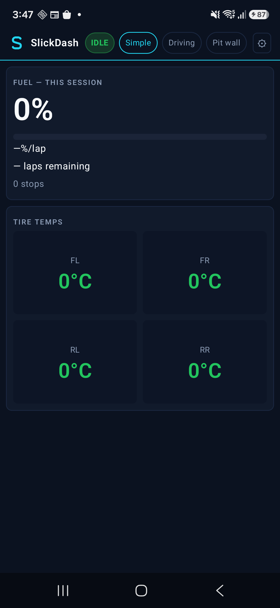
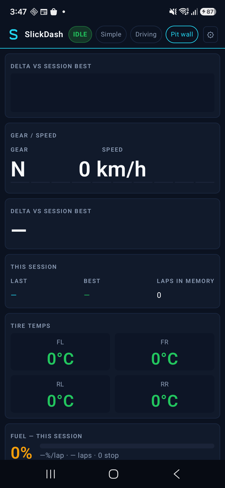

# SlickDash (iOS)

SwiftUI companion for **Gran Turismo 7** live telemetry.

Not affiliated with Sony Interactive Entertainment or Polyphony Digital.

## Screenshots

| Simple | Driving | Pit wall |
| --- | --- | --- |
|  |  |  |

Interim companion shots for Simple / Driving / Pit wall (IDLE UI layout). Swap for device/Simulator captures before App Store listing.

## Run

```bash
brew install xcodegen
cd gran-turismo-telemetry-ios
xcodegen generate
open SlickDash.xcodeproj
```

Find PS5 on launch. Simple is the default. Needs a device (or simulator for UI only) on the same LAN as the PS5. Local network permission is required.

Heartbeat UDP 33739, receive 33740. iOS 17+.

## CI

GitHub Actions on `macos-latest` runs XcodeGen then an unsigned Simulator build. No Apple signing secrets or Sentry auth tokens are used.
